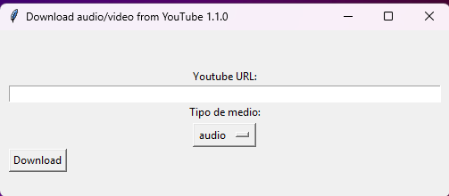

# Yotb-dl

Python GUI wrapper for download audio and video

## Requirements
* Python 3
* pip
* ffmpeg (https://ffmpeg.org)
* yt-dlp (https://github.com/yt-dlp/yt-dlp)



## Install Thinker as System Level
Windows

Comes with the python bundle.

Linux

```bash
sudo apt-get install python3-tk
```

MacOS

```bash
brew install python-tk
```

## Install local dependencies
```bash
pip install -r requirements.txt
```

## Install FFmpeg
Windows (PowerShell with Administration rights)
```bash
choco install ffmpeg
```

Linux 
```bash
sudo apt-get install ffmpeg
```

MacOS
```bash
brew install ffmpeg
```

## Generate binary
Install pyinstaller
```bash
pip install pyinstaller
```

Generate the binary
```bash
pyinstaller --onefile --noconsole yotb-dl.py
```
